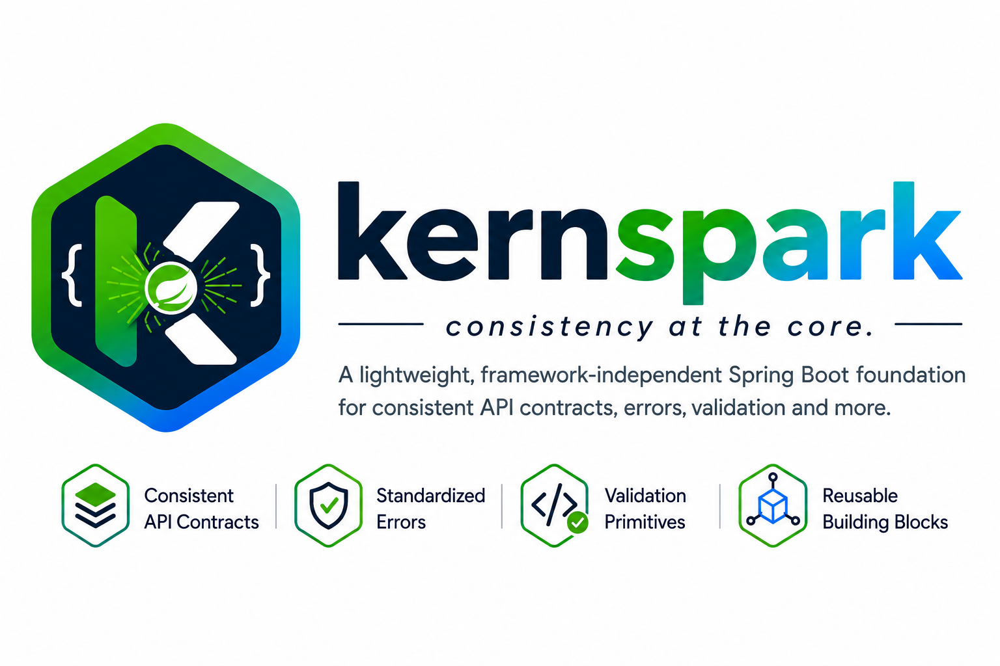

<p align="center">
  
</p>

# @syncafricabs/kernspark-core

[](https://opensource.org/licenses/Apache-2.0)
[](https://openjdk.org/)
[](https://spring.io/projects/spring-boot)

Spring Boot adapter for standardized API responses, validation, error handling, and reusable backend building blocks. Zero runtime dependencies beyond Spring Boot.

## Table of Contents

- [What is it?](#what-is-it)
- [Why does it exist?](#why-does-it-exist)
- [Architecture](#architecture)
- [Packages](#packages)
- [When to use it](#when-to-use-it)
- [When NOT to use it](#when-not-to-use-it)
- [Installation](#installation)
- [Core Concepts](#core-concepts)
    - [Data Envelope](#data-envelope)
    - [Application Errors](#application-errors)
    - [Validation](#validation)
    - [Utilities](#utilities)
- [Usage Example](#usage-example)
    - [Object-Level Validation Pattern](#object-level-validation-pattern)
    - [Per-Field Validation Pattern (Recommended)](#per-field-validation-pattern-recommended)
- [API Reference](#api-reference)
- [Error Handling Reference](#error-handling-reference)
- [Compatibility Matrix](#compatibility-matrix)
- [Contributing](#contributing)
- [License](#license)
- [Author](#author)

## What is it?

`com.syncafricabs:kernspark-core` provides framework-specific building blocks for building consistent, type-safe Spring Boot applications:

- **Data Envelope** — Standardized `DataEnvelope<T>` response wrapper for consistent success/error payloads
- **Application Errors** — Refined exception hierarchy with error codes, HTTP status codes, and cause chains
- **Validation** — Generic field validators that complement Jakarta Validation
- **Utilities** — Generic helpers for common operations

The library has **zero runtime dependencies beyond Spring Boot**. It ships both framework-independent core types and Spring Boot integration in a single artifact.

## Why does it exist?

Every Spring Boot team eventually builds the same primitives:

- Standardized JSON response envelopes
- Exception hierarchies
- Input validation helpers
- Global exception handlers

Instead of each team reinventing these, the Spring adapter provides a **single, well-tested, open-source foundation** that works with Spring Boot.

## Architecture

```
com.syncafricabs:kernspark-core
    │
    ├── com.syncafricabs.kernspark.core
    │       ├── DataEnvelope
    │       ├── DataEnvelopeFactory
    │       ├── Application/domain exceptions
    │       ├── Validation primitives
    │       ├── Domain primitives
    │       └── Generic utilities
    │
    └── com.syncafricabs.kernspark.spring
            ├── ResponseEntityBuilder
            ├── GlobalExceptionHandler
            └── Spring-specific utilities
```

**Key architectural rule:** The `core` package must **NOT** depend on Spring. Framework-specific functionality belongs in the `spring` package. Both packages are shipped together in this single Maven artifact.

## Packages

| Package | Description |
|---------|-------------|
| `com.syncafricabs.kernspark.core` | Framework-independent core |
| `com.syncafricabs.kernspark.spring` | Spring Boot adapter |

## When to use it

- You want **consistent API responses** across your Spring Boot services
- You need a **shared exception hierarchy** that works across bounded contexts
- You want to reduce boilerplate for validation, pagination, and response formatting
- You are building a **microservice architecture** where multiple teams share common contracts
- You need **production-ready** building blocks that are open-source and community-driven

## When NOT to use it

- You need a full backend framework (this is not a replacement for Spring Boot)
- You need an ORM or database access layer (use Spring Data JPA, Hibernate, etc.)
- You need authentication/authorization frameworks (use Spring Security)
- You need logging frameworks (use SLF4J, Logback, etc.)
- You need validation frameworks (use Jakarta Validation, Hibernate Validator — this complements them)
- You need application-specific business logic (keep that in your domain layer)

**Philosophy:** Complement the existing ecosystem, don't replace it.

## Installation

### Maven

```xml
<dependency>
    <groupId>com.syncafricabs</groupId>
    <artifactId>kernspark-core</artifactId>
    <version>1.0.1</version>
</dependency>
```

### Gradle

```groovy
implementation 'com.syncafricabs:kernspark-core:1.0.1'
```

## Core Concepts

### Data Envelope

`DataEnvelope<T>` is a plain, `@Builder`-friendly POJO (not a sealed interface with `Delivered`/`Failed` variants). Every API response — success or error — is returned as this same shape:

```java
package com.syncafricabs.kernspark.core;

import lombok.AllArgsConstructor;
import lombok.Builder;
import lombok.Data;
import lombok.NoArgsConstructor;

import java.io.Serializable;

@Data
@Builder
@NoArgsConstructor
@AllArgsConstructor
public class DataEnvelope<T> implements Serializable {
    private int code;
    private String message;
    private boolean success;
    private T data;
}
```

On the wire it serializes as:

```json
// Success
{
  "code": 200,
  "success": true,
  "data": { "id": 1, "name": "John" },
  "message": "OK"
}

// Error
{
  "code": 400,
  "success": false,
  "message": "USER_EMAIL_REQUIRED: Email is required",
  "data": null
}
```

**Key design decisions:**

- `code` is the HTTP status code
- `success` is a boolean discriminator for type-safe handling
- `data` carries the payload for success responses (or `null` for errors)
- `message` is the human-readable description

**No separate `errorCode` field.** `DataEnvelope` intentionally stays flat with just `code` / `message` / `success` / `data`. `DataEnvelopeFactory`'s error-producing methods (`badRequest`, `notFound`, `conflict`, etc.) still accept an `errorCode` parameter, but it's folded directly into `message` as `"ERROR_CODE: human readable message"` rather than shipped as its own JSON field:

```json
{
  "code": 400,
  "success": false,
  "message": "USER_EMAIL_REQUIRED: Email is required",
  "data": null
}
```

If you need `errorCode` to stay machine-parseable as its own field on the client side, split on the first `": "` in `message`, or wrap `DataEnvelope` with your own DTO before it leaves the API layer.

### Application Errors

The library provides a refined exception hierarchy:

```
ApplicationException (base)
├── ValidationException
│   ├── MissingFieldsException
│   └── InvalidException
├── BusinessException
│   ├── AlreadyExistsException
│   ├── InsufficientFundsException
│   ├── QuotaExceededException
│   ├── NotFoundException
│   ├── ExpiredException
│   ├── TooManyRequestsException
│   ├── PaymentRequiredException
│   ├── LockedException
│   ├── AccountSuspendedException
│   ├── FeatureNotAvailableException
│   └── DataIntegrityException
├── AuthenticationException
│   ├── InvalidTokenException
│   ├── TokenExpiredException
│   └── SessionExpiredException
├── AuthorizationException
│   ├── PermissionDeniedException
│   └── NotAllowedException
└── InfrastructureException
    ├── ExternalServiceException
    ├── BadGatewayException
    ├── GatewayTimeoutException
    ├── ServiceUnavailableException
    ├── RequestFailedException
    ├── NotImplementedException
    └── MaintenanceModeException
```

Each exception carries:
- `errorCode` — machine-readable code (e.g., `USER_NOT_FOUND`)
- `statusCode` — HTTP status for adapters
- `message` — human-readable description
- `cause` — optional underlying error

**Usage:**

```java
import com.syncafricabs.kernspark.core.exception.NotFoundException;
import com.syncafricabs.kernspark.core.exception.ValidationException;
import com.syncafricabs.kernspark.core.exception.AlreadyExistsException;

// Throw in your service layer
throw new NotFoundException("User not found");
throw new ValidationException("INVALID_EMAIL", "Email format is invalid");
throw new AlreadyExistsException("User already exists");
```

The `GlobalExceptionHandler` automatically maps these to HTTP responses.

### Validation

`FieldValidator` provides generic validation primitives that complement Jakarta Validation:

```java
import com.syncafricabs.kernspark.core.validation.FieldValidator;

// Strings
FieldValidator.validateString(name, "Name", 2, 100);

// Email
FieldValidator.validateEmail(email, "Email");

// Phone
FieldValidator.validatePhone(phone, "Phone");

// URL
FieldValidator.validateUrl(website, "Website");

// UUID
FieldValidator.validateUUID(id, "Id");

// Numbers
FieldValidator.validatePositiveLong(userId, "UserId");
FieldValidator.validateInteger(count, "Count");
FieldValidator.validatePeriod(days, "Days");
FieldValidator.validateSizeLimit(limit, "Limit");
FieldValidator.validateFee(fee, "Fee");

// Other
FieldValidator.validateNonNull(value, "Value");
FieldValidator.validateNonEmptyList(items, "Items");
FieldValidator.validateEnum(Gender.class, gender, "Gender");
FieldValidator.validateBoolean(active, "Active");
FieldValidator.validatePattern(code, Pattern.compile("^[A-Z]{3}$"), "Code");
        FieldValidator.validateNumericRange(age, 18, 120, "Age");
FieldValidator.validateColumnName(columnName, "ColumnName");
FieldValidator.validateDateOfBirth(dob, "DateOfBirth");
FieldValidator.validatePaymentDate(paymentDate, "PaymentDate");
FieldValidator.validateOpeningDate(openingDate, "OpeningDate");
```

**Important:** Business rules should remain in your application's domain/application layer. This package provides generic primitives, not a complete validation framework.

### Utilities

`BigDecimalUtils` provides null-safe arithmetic, formatting, and parsing helpers:

```java
import com.syncafricabs.kernspark.core.BigDecimalUtils;
import java.math.BigDecimal;

// Null-safe defaults
BigDecimalUtils.valueOrZero(amount);           // null → 0

// Arithmetic
BigDecimalUtils.add(price, tax);
BigDecimalUtils.divide(total, new BigDecimal("2"));
        BigDecimalUtils.multiply(quantity, unitPrice);

// Formatting
BigDecimalUtils.format(amount);              // "99.99"
BigDecimalUtils.formatAsCurrency(amount);    // "99.99"
BigDecimalUtils.formatAsPercentage(rate);    // "15.67%"

// Parsing
BigDecimalUtils.parse("99.99");                // BigDecimal
BigDecimalUtils.parse("abc", BigDecimal.ZERO); // default if unparseable
```

**Note:** HTML sanitization has been removed. Use a dedicated sanitization library for security-sensitive operations.

## Usage Example

Kernspark supports two common patterns for wiring `FieldValidator` into a Spring `Validator` bean, depending on whether you want a single flat validation message or a field-keyed error map. Both use the same `SampleClassRequest` / `SampleClassResponse` models, the same `SampleService`, and the same `GlobalExceptionHandler` fallback — the only difference is how the `Validator` reports failures to Spring's `Errors`/`BindingResult`.

### Model — Request

The request model is a plain data holder. It carries no validation or HTTP logic of its own.

```java
@Data
public class SampleClassRequest implements Serializable {

    private String fullName;
    private String phoneNumber;
    private String emailAddress;
    private String uuidValue;
    private BigDecimal amount;
    private LocalDate paymentDate;
    private Gender gender;
}
```

### Model — Response

The response model represents the data returned after the request has been successfully processed.

```java
@Data
public class SampleClassResponse implements Serializable {

    private String fullName;
    private String phoneNumber;
    private String emailAddress;
    private String uuidValue;
    private BigDecimal amount;
    private LocalDate paymentDate;
    private Gender gender;
}
```

### Service

`SampleService` doesn't need to know which validation pattern the controller uses — by the time `createSample(...)` runs, the `Validator` bean has already guaranteed the request is valid (or Spring has already short-circuited with a `MethodArgumentNotValidException`). The service goes straight to building the response, and still owns building the `ResponseEntity<DataEnvelope<Object>>` via `ResponseEntityBuilder`, so the controller can return it unchanged. A `catch (Exception e)` remains as a safety net for unexpected runtime errors during processing; anything not caught here still falls through to `GlobalExceptionHandler.handleGenericException(...)`.

```java
@Slf4j
@Service
public class SampleService {

    public ResponseEntity<DataEnvelope<Object>> createSample(SampleClassRequest request) {

        try {
            SampleClassResponse response = new SampleClassResponse();
            response.setFullName(request.getFullName());
            response.setPhoneNumber(request.getPhoneNumber());
            response.setEmailAddress(request.getEmailAddress());
            response.setUuidValue(request.getUuidValue());
            response.setAmount(request.getAmount());
            response.setPaymentDate(request.getPaymentDate());
            response.setGender(request.getGender());

            log.info("Sample created for id: {}", request.getUuidValue());

            return ResponseEntityBuilder.created(
                    "Sample data passed the validation successfully",
                    response
            );

        } catch (Exception e) {
            log.error("Error creating sample data: {}", e.getMessage(), e);
            return ResponseEntityBuilder.internalServerError(
                    "REQUEST_FAILED",
                    "Failed to create sample data",
                    null
            );
        }
    }
}
```

> **Note:** This `catch (Exception e)` is optional — `GlobalExceptionHandler.handleGenericException(...)` already produces an equivalent 500 response for any uncaught exception. Keep it only if you want service-specific logging or a custom message for this endpoint; otherwise you can drop the try/catch entirely and let unexpected errors propagate to the global handler.

### Object-Level Validation Pattern

This is the simplest pattern: each `FieldValidator` call runs in sequence, and the **first** `ValidationException` thrown stops the method and is registered as a single object-level rejection via `errors.reject(...)`. It's easy to write, but it means only the first invalid field is reported per request — a client fixing one field at a time will discover the next error only on their next submission.

`SampleRequestValidator` implements Spring's `org.springframework.validation.Validator` interface. It uses `FieldValidator` for the actual checks and converts any `ValidationException` into an `errors.reject(...)` call, which Spring collects into a `BindingResult`.

```java
@Component
public class SampleRequestValidator implements org.springframework.validation.Validator {

    @Override
    public boolean supports(Class<?> clazz) {
        return SampleClassRequest.class.isAssignableFrom(clazz);
    }

    @Override
    public void validate(Object target, Errors errors) {
        SampleClassRequest request = (SampleClassRequest) target;
        try {
            FieldValidator.validateAmount(request.getAmount(), " Amount", BigDecimal.valueOf(10));
            FieldValidator.validateString(request.getFullName(), " User full name", 3, 30);
            FieldValidator.validateEmail(request.getEmailAddress(), " User email address");
            FieldValidator.validatePhone(request.getPhoneNumber(), " User phone number");
            FieldValidator.validateUUID(request.getUuidValue(), " UUID value");
            FieldValidator.validateEnum(Gender.class, request.getGender(), " User gender");
            FieldValidator.validateDatesBeforeToday(request.getPaymentDate(), " Payment date");
        } catch (ValidationException e) {
            errors.reject(e.getErrorCode(), e.getMessage());
        }
    }
}
```

### Controller — POST (Create)

The controller registers `SampleRequestValidator` for the `request` argument via `@InitBinder`, and annotates the parameter with `@Valid`. If validation fails, Spring throws `MethodArgumentNotValidException` before `create(...)` runs, and `GlobalExceptionHandler.handleValidationExceptions(...)` returns the standardized error response automatically. Since `SampleService.createSample(...)` already returns a fully built `ResponseEntity<DataEnvelope<Object>>`, the controller just returns it directly.

```java
@Slf4j
@RestController
@RequestMapping("/api/samples")
public class SampleController {

    private final SampleService sampleService;
    private final SampleRequestValidator sampleRequestValidator;

    public SampleController(SampleService sampleService, SampleRequestValidator sampleRequestValidator) {
        this.sampleService = sampleService;
        this.sampleRequestValidator = sampleRequestValidator;
    }

    @InitBinder("request")
    public void initBinder(WebDataBinder binder) {
        binder.addValidators(sampleRequestValidator);
    }

    @PostMapping
    public ResponseEntity<DataEnvelope<Object>> create(@Valid @RequestBody SampleClassRequest request) {

        log.info("Creating sample: {}", request.getFullName());

        return sampleService.createSample(request);
    }
}
```

> **Note:** `@InitBinder` scopes the validator to controller methods on the same `@RestController`. If `SampleService.createSample(...)` may also be called from outside this controller (another service, a message listener, a batch job), consider additionally enabling method-level validation with `@Validated` on `SampleService` and Bean Validation annotations on `SampleClassRequest`, so the guarantee holds for every caller, not just this one HTTP endpoint.

### Per-Field Validation Pattern (Recommended)

Instead of stopping at the first failure, this pattern runs **every** `FieldValidator` check independently, catching each `ValidationException` where it happens and registering it against its own field via `errors.rejectValue(fieldName, ...)` instead of a generic object-level error. The result is a `BindingResult` with one `FieldError` per invalid field, so `GlobalExceptionHandler.handleValidationExceptions(...)` can return **all** invalid fields in a single response — which is what a form-driven or mobile client typically wants, since it can highlight every invalid input at once instead of round-tripping one error at a time.

The trick is the small `checkField` helper: it wraps a single check in a try/catch so that one failing field never stops the remaining fields from also being checked, and it keys each failure by the actual DTO field name rather than a generic object-level rejection.

#### Why report every invalid field at once?

With the object-level pattern, `FieldValidator` calls run in sequence and the first `ValidationException` thrown aborts the rest of the method — so a client only ever learns about one bad field per submission. With the per-field pattern, every check runs regardless of whether an earlier one failed, so a single submit can surface the complete picture:

- **Fewer round trips.** A frontend form with several invalid fields gets all the errors in one response, instead of the user fixing one field, resubmitting, hitting the next error, fixing that, resubmitting again, and so on.
- **Field-level highlighting.** Because each error is keyed by field name (`amount`, `emailAddress`, `phoneNumber`, `uuidValue`, ...) rather than a single flat message, the frontend can map each entry in `data` directly onto the corresponding input and show an inline error next to it — no string-matching or guessing which field a generic message refers to.
- **Better perceived performance and lower frustration.** Users generally expect a "submit" click to validate the whole form, not just the first field top-to-bottom; discovering errors one at a time feels slow and unpredictable, especially on longer forms.
- **Fewer wasted requests.** Each avoidable resubmission is a full HTTP round trip through validation, binding, and the exception handler for information the server already had on the first attempt — reporting everything up front cuts that down to as few requests as the data actually requires.
- **Fields that did pass stay out of the response**, as shown in the example below — `data` only ever contains the fields that failed, so the frontend doesn't need to reconcile a full field list against a partial error list.

The trade-off is minor: every `FieldValidator` check always runs, even after an earlier one has already failed, so validation does slightly more work per request than the fail-fast object-level pattern. For typical request sizes this is negligible compared to the UX gain.

```java
package com.samples.provytest.service;

import com.samples.provytest.enums.Gender;
import com.samples.provytest.model.SampleClassRequest;
import com.syncafricabs.kernspark.core.exception.ValidationException;
import com.syncafricabs.kernspark.core.validation.FieldValidator;
import org.springframework.stereotype.Component;
import org.springframework.validation.Errors;

import java.math.BigDecimal;

@Component
public class SampleRequestValidator implements org.springframework.validation.Validator {

    @Override
    public boolean supports(Class<?> clazz) {
        return SampleClassRequest.class.isAssignableFrom(clazz);
    }

    @Override
    public void validate(Object target, Errors errors) {
        SampleClassRequest request = (SampleClassRequest) target;

        checkField(errors, "amount", () ->
                FieldValidator.validateAmount(request.getAmount(), "Amount", BigDecimal.valueOf(10)));

        checkField(errors, "fullName", () ->
                FieldValidator.validateString(request.getFullName(), "User full name", 3, 30));

        checkField(errors, "emailAddress", () ->
                FieldValidator.validateEmail(request.getEmailAddress(), "User email address"));

        checkField(errors, "phoneNumber", () ->
                FieldValidator.validatePhone(request.getPhoneNumber(), "User phone number"));

        checkField(errors, "uuidValue", () ->
                FieldValidator.validateUUID(request.getUuidValue(), "UUID value"));

        checkField(errors, "gender", () ->
                FieldValidator.validateEnum(Gender.class, request.getGender(), "User gender"));

        checkField(errors, "paymentDate", () ->
                FieldValidator.validateDatesBeforeToday(request.getPaymentDate(), "Payment date"));
    }

    /**
     * Runs a single FieldValidator check in isolation, so one failing field
     * never prevents the remaining fields from also being checked.
     * On failure, registers a proper FieldError (via rejectValue) keyed by
     * the actual DTO field name, instead of a generic object-level error.
     */
    private void checkField(Errors errors, String fieldName, Runnable check) {
        try {
            check.run();
        } catch (ValidationException e) {
            errors.rejectValue(fieldName, e.getErrorCode(), e.getMessage());
        }
    }
}
```

Wiring is identical to the object-level pattern — `@InitBinder` plus `@Valid` — only the request mapping and package differ in this example:

```java
package com.samples.provytest.controller;

import com.samples.provytest.model.SampleClassRequest;
import com.samples.provytest.model.SampleClassResponse;
import com.samples.provytest.service.SampleRequestValidator;
import com.samples.provytest.service.SampleService;
import com.syncafricabs.kernspark.core.DataEnvelope;
import jakarta.validation.Valid;
import lombok.extern.slf4j.Slf4j;
import org.springframework.http.ResponseEntity;
import org.springframework.web.bind.WebDataBinder;
import org.springframework.web.bind.annotation.*;

@Slf4j
@RestController
@RequestMapping("/api/kernspark/samples/")
public class SampleClassController {

    private final SampleService sampleService;
    private final SampleRequestValidator sampleRequestValidator;

    public SampleClassController(SampleService sampleService, SampleRequestValidator sampleRequestValidator) {
        this.sampleService = sampleService;
        this.sampleRequestValidator = sampleRequestValidator;
    }

    @InitBinder
    public void initBinder(WebDataBinder binder) {
        binder.addValidators(sampleRequestValidator);
    }

    @PostMapping(value = "/create")
    public ResponseEntity<DataEnvelope<Object>> create(@Valid @RequestBody SampleClassRequest request) {

        log.info("Creating sample: {}", request.getFullName());

        return sampleService.createSample(request);
    }
}
```

#### Example Request — Multiple Invalid Fields

```json
POST /api/kernspark/samples/create
{
  "fullName": "Providence Chikukwa",
  "phoneNumber": "string",
  "emailAddress": "string",
  "uuidValue": "string",
  "amount": 5,
  "paymentDate": "2026-08-13",
  "gender": "MALE"
}
```

Because each check runs in its own isolated `checkField(...)` call, every invalid field is reported in one response — not just the first one encountered:

```json
{
  "code": 400,
  "message": "VALIDATION_ERROR: Validation failed",
  "success": false,
  "data": {
    "amount": "Amount must be at least 10",
    "emailAddress": "User email address has invalid format",
    "phoneNumber": "User phone number must be at least 10 characters long",
    "uuidValue": "Invalid UUID value value: "
  }
}
```

Note `fullName`, `gender`, and `paymentDate` passed validation and are correctly omitted from `data` — only the four invalid fields are reported.

#### Example Request — Valid Payload

```json
POST /api/kernspark/samples/create
{
  "fullName": "Providence Chikukwa",
  "phoneNumber": "+263784340477",
  "emailAddress": "iamprovy@outlook.com",
  "uuidValue": "550e8400-e29b-41d4-a716-446655440000",
  "amount": 10000,
  "paymentDate": "2026-08-13",
  "gender": "MALE"
}
```

```json
{
  "code": 201,
  "message": "Sample data passed the validation successfully",
  "success": true,
  "data": {
    "amount": 10000,
    "emailAddress": "iamprovy@outlook.com",
    "fullName": "Providence Chikukwa",
    "gender": "MALE",
    "paymentDate": "2026-08-13",
    "phoneNumber": "+263784340477",
    "uuidValue": "550e8400-e29b-41d4-a716-446655440000"
  }
}
```

### Validation Flow

The recommended flow, applicable to either pattern above, is:

1. The controller receives a `SampleClassRequest` annotated with `@Valid`.
2. Spring's data binder invokes the registered `Validator`, wired via `@InitBinder`, before the controller method body executes.
3. The `Validator` runs `FieldValidator` checks and reports failures to `Errors` — either as a single object-level `errors.reject(...)` (object-level pattern), or as one `errors.rejectValue(...)` per invalid field (per-field pattern).
4. If validation fails, Spring throws `MethodArgumentNotValidException`, which `GlobalExceptionHandler.handleValidationExceptions(...)` catches and returns as a standardized `DataEnvelope` bad-request response — the controller method never runs.
5. If validation succeeds, the controller method runs with a request guaranteed to be valid.
6. `SampleService.createSample(...)` processes the request and returns a fully built `ResponseEntity<DataEnvelope<Object>>` via `ResponseEntityBuilder`.
7. The controller returns the service's response directly.

This keeps validation and business logic in separate, single-responsibility places — the `Validator` bean and the `Service` — while the `Service` still owns HTTP-response construction for this endpoint, and `GlobalExceptionHandler` remains the fallback for anything the controller and service don't handle themselves (binding failures, and any other uncaught exception).

## API Reference

### DataEnvelope

`DataEnvelope<T>` is a single concrete class (not an interface with separate success/error implementations) used as the return type for both outcomes:

```java
// Success response
DataEnvelope<T> response = DataEnvelopeFactory.success("OK", data);

// Error response
DataEnvelope<E> response = DataEnvelopeFactory.notFound("USER_NOT_FOUND", "User not found", null);

// Same type either way
response.isSuccess();  // true for success, false for error
response.getCode();    // HTTP status code
response.getData();    // payload, or null for errors
response.getMessage(); // human-readable description ("ERROR_CODE: message" for errors)
```

### DataEnvelopeFactory

All methods return a plain `DataEnvelope<T>` (or `DataEnvelope<E>` for error variants). Every method below also has a 2-arg overload that omits `data` (defaults to `null`) unless noted otherwise. Error-producing methods fold `errorCode` into `message` as `"errorCode: message"` — see [Data Envelope](#data-envelope).

**Success (2xx / 3xx)**

| Method | Status | Description |
|--------|--------|-------------|
| `success(message, data)` | 200 | Create success response |
| `success(message)` | 200 | Success response with no data |
| `ok(message, data)` | 200 | Alias for `success` |
| `created(message, data)` | 201 | Create created response |
| `accepted(message, data)` | 202 | Create accepted response |
| `noContent(message)` | 204 | Create no-content response |
| `notModified(message)` | 304 | Not-modified response (treated as success) |

**Client errors (4xx)**

| Method | Status | Description |
|--------|--------|-------------|
| `badRequest(errorCode, message, data)` | 400 | Create bad request response |
| `unauthorized(errorCode, message, data)` | 401 | Create unauthorized response |
| `paymentRequired(errorCode, message, data)` | 402 | Create payment required response |
| `forbidden(errorCode, message, data)` | 403 | Create forbidden response |
| `notFound(errorCode, message, data)` | 404 | Create not found response |
| `conflict(errorCode, message, data)` | 409 | Create conflict response |
| `gone(errorCode, message, data)` | 410 | Create gone response |
| `unprocessableEntity(errorCode, message, data)` | 422 | Create unprocessable entity response |
| `locked(errorCode, message, data)` | 423 | Create locked response |
| `tooManyRequests(errorCode, message, data)` | 429 | Create too many requests response |

**Server errors (5xx)**

| Method | Status | Description |
|--------|--------|-------------|
| `internalServerError(errorCode, message, data)` | 500 | Create internal server error response |
| `notImplemented(errorCode, message, data)` | 501 | Create not implemented response |
| `badGateway(errorCode, message, data)` | 502 | Create bad gateway response |
| `serviceUnavailable(errorCode, message, data)` | 503 | Create service unavailable response |
| `gatewayTimeout(errorCode, message, data)` | 504 | Create gateway timeout response |

**Exception-specific convenience methods**

These simply delegate to one of the methods above, so the error class you're mapping from reads directly off the method name:

| Method | Delegates to | Status |
|--------|---------------|--------|
| `validationError(errorCode, message, data)` | `badRequest` | 400 |
| `missingFields(errorCode, message, data)` | `badRequest` | 400 |
| `invalid(errorCode, message, data)` | `badRequest` | 400 |
| `insufficientFunds(errorCode, message, data)` | `badRequest` | 400 |
| `invalidToken(errorCode, message, data)` | `unauthorized` | 401 |
| `tokenExpired(errorCode, message, data)` | `unauthorized` | 401 |
| `sessionExpired(errorCode, message, data)` | `unauthorized` | 401 |
| `accountSuspended(errorCode, message, data)` | `forbidden` | 403 |
| `permissionDenied(errorCode, message, data)` | `forbidden` | 403 |
| `notAllowed(errorCode, message, data)` | `forbidden` | 403 |
| `alreadyExists(errorCode, message, data)` | `conflict` | 409 |
| `expired(errorCode, message, data)` | `gone` | 410 |
| `dataIntegrityError(errorCode, message, data)` | `unprocessableEntity` | 422 |
| `quotaExceeded(errorCode, message, data)` | `tooManyRequests` | 429 |
| `requestFailed(errorCode, message, data)` | `internalServerError` | 500 |
| `featureNotAvailable(errorCode, message, data)` | `notImplemented` | 501 |
| `externalServiceError(errorCode, message, data)` | `badGateway` | 502 |
| `maintenanceMode(errorCode, message, data)` | `serviceUnavailable` | 503 |

### ResponseEntityBuilder

Same idea as `DataEnvelopeFactory`, but returns `ResponseEntity<DataEnvelope<T>>` (or `<E>`) with the status already set on the response — use this directly from controllers/services instead of building the envelope and status separately.

**Success (2xx / 3xx)**

| Method | Status | Description |
|--------|--------|-------------|
| `ok(message, data)` | 200 | Create success response |
| `ok(data)` | 200 | Success response, default `"Success"` message |
| `ok()` | 200 | Success response, no message or data |
| `created(message, data)` | 201 | Create created response |
| `accepted(message, data)` | 202 | Create accepted response |
| `accepted(message)` | 202 | Accepted response, no data |
| `accepted(data)` | 202 | Accepted response, default `"Request accepted"` message |
| `noContent(message)` | 204 | Create no-content response |
| `noContent()` | 204 | No-content response, default `"No content"` message |
| `resetContent(message, data)` | 205 | Reset content response |
| `multipleChoices(message, data)` | 300 | Multiple choices response |
| `movedPermanently(message, data)` | 301 | Moved permanently response |
| `found(message, data)` | 302 | Found (redirect) response |
| `seeOther(message, data)` | 303 | See other response |
| `notModified(message)` | 304 | Not modified response |
| `temporaryRedirect(message, data)` | 307 | Temporary redirect response |
| `permanentRedirect(message, data)` | 308 | Permanent redirect response |

**Client errors (4xx)**

| Method | Status | Description |
|--------|--------|-------------|
| `badRequest(errorCode, message, data)` | 400 | Create bad request response |
| `unauthorized(errorCode, message, data)` | 401 | Create unauthorized response |
| `invalidCredentials(errorCode, message, data)` | 401 | Unauthorized response, credential-specific naming |
| `tokenExpired(errorCode, message, data)` | 401 | Unauthorized response, expired-token naming |
| `forbidden(errorCode, message, data)` | 403 | Create forbidden response |
| `accessDenied(errorCode, message, data)` | 403 | Forbidden response, access-denied naming |
| `insufficientPermissions(errorCode, message, data)` | 403 | Forbidden response, permissions naming |
| `notFound` | — | *Not present — use `DataEnvelopeFactory.notFound(...)` and wrap it with `ResponseEntity.status(404).body(...)`, or add it via `build(...)` (see below) |
| `methodNotAllowed(errorCode, message, data)` | 405 | Method not allowed response |
| `notAcceptable(errorCode, message, data)` | 406 | Not acceptable response |
| `requestTimeout(errorCode, message, data)` | 408 | Request timeout response |
| `conflict(errorCode, message, data)` | 409 | Create conflict response |
| `alreadyExists(errorCode, message, data)` | 409 | Conflict response, already-exists naming |
| `gone(errorCode, message, data)` | 410 | Gone response |
| `expired(errorCode, message, data)` | 410 | Gone response, expired naming |
| `lengthRequired(errorCode, message, data)` | 411 | Length required response |
| `preconditionFailed(errorCode, message, data)` | 412 | Precondition failed response |
| `payloadTooLarge(errorCode, message, data)` | 413 | Payload too large response |
| `uriTooLong(errorCode, message, data)` | 414 | URI too long response |
| `unsupportedMediaType(errorCode, message, data)` | 415 | Unsupported media type response |
| `unprocessableEntity(errorCode, message, data)` | 422 | Unprocessable entity response |
| `validationError(errorCode, message, data)` | 422 | Unprocessable entity response, validation naming |
| `tooManyRequests(errorCode, message, data)` | 429 | Too many requests response |
| `rateLimited(errorCode, message, data)` | 429 | Too many requests response, rate-limit naming |

**Server errors (5xx)**

| Method | Status | Description |
|--------|--------|-------------|
| `notImplemented(errorCode, message, data)` | 501 | Not implemented response |
| `badGateway(errorCode, message, data)` | 502 | Bad gateway response |
| `serviceUnavailable(errorCode, message, data)` | 503 | Service unavailable response |
| `gatewayTimeout(errorCode, message, data)` | 504 | Gateway timeout response |
| `httpVersionNotSupported(errorCode, message, data)` | 505 | HTTP version not supported response |

**Generic escape hatch**

| Method | Description |
|--------|-------------|
| `build(status, message, data)` | Wraps a success-style `DataEnvelope` in a `ResponseEntity` at any custom `HttpStatus` |
| `build(status, errorCode, message, data)` | Wraps an error-style `DataEnvelope` in a `ResponseEntity` at any custom `HttpStatus` |

Use `build(...)` whenever you need a status code that doesn't have its own named method above — for example the missing `notFound` on `ResponseEntityBuilder`, a non-standard 2xx, or a status specific to your API (like `226 IM Used` or a custom `4xx`/`5xx` your gateway expects).

```java
import com.syncafricabs.kernspark.spring.ResponseEntityBuilder;
import org.springframework.http.HttpStatus;
import org.springframework.http.ResponseEntity;

// Success-style envelope at a status with no dedicated method,
// e.g. filling the gap left by the missing ResponseEntityBuilder.notFound(...)
ResponseEntity<DataEnvelope<SampleClassResponse>> found = ResponseEntityBuilder.build(
        HttpStatus.OK,
        "Sample retrieved",
        response
);

// Error-style envelope at a custom status
ResponseEntity<DataEnvelope<Object>> notFound = ResponseEntityBuilder.build(
        HttpStatus.NOT_FOUND,
        "SAMPLE_NOT_FOUND",
        "No sample exists for the given id",
        null
);

// Any other status your API needs to return, e.g. 226 IM Used
ResponseEntity<DataEnvelope<Object>> custom = ResponseEntityBuilder.build(
        HttpStatus.IM_USED,
        "DELTA_APPLIED",
        "Partial update applied via delta encoding",
        null
);
```

Both overloads resolve to a `DataEnvelope` shaped exactly like the named methods above — `build(status, message, data)` sets `success: true` with `code` set to the given status, and `build(status, errorCode, message, data)` sets `success: false` and folds `errorCode` into `message` as `"errorCode: message"`, same as every other error-producing method in this library.

> **Note:** most 2-arg `(errorCode, message)` overloads shown above also exist and default `data` to `null`; only the 3-arg forms are listed here for brevity. Also note several of these builders (`methodNotAllowed`, `notAcceptable`, `requestTimeout`, `gone`, `lengthRequired`, `preconditionFailed`, `payloadTooLarge`, `uriTooLong`, `unsupportedMediaType`, `notImplemented`, `httpVersionNotSupported`) currently build their envelope via `DataEnvelopeFactory.badRequest(...)` internally even though the `ResponseEntity` itself carries the correct HTTP status — so the envelope's `code` field may not always match the outer HTTP status for those specific methods. Worth double-checking against your own copy of `ResponseEntityBuilder` if you rely on `code` downstream.

### ApplicationException

```java
public abstract class ApplicationException extends RuntimeException {
    private final String errorCode;
    private final int statusCode;
    private final String message;
    private final Throwable cause;
}
```

## Error Handling Reference

The library provides these error classes:

| Error Class | HTTP Status | Error Code |
|-------------|-------------|------------|
| `ValidationException` | 400 | Custom |
| `MissingFieldsException` | 400 | `MISSING_FIELDS` |
| `InvalidException` | 400 | `INVALID` |
| `AlreadyExistsException` | 409 | `ALREADY_EXISTS` |
| `InsufficientFundsException` | 400 | `INSUFFICIENT_FUNDS` |
| `QuotaExceededException` | 429 | `QUOTA_EXCEEDED` |
| `NotFoundException` | 404 | `NOT_FOUND` |
| `ExpiredException` | 410 | `EXPIRED` |
| `TooManyRequestsException` | 429 | `TOO_MANY_REQUESTS` |
| `PaymentRequiredException` | 402 | `PAYMENT_REQUIRED` |
| `LockedException` | 423 | `LOCKED` |
| `AccountSuspendedException` | 403 | `ACCOUNT_SUSPENDED` |
| `FeatureNotAvailableException` | 501 | `FEATURE_NOT_AVAILABLE` |
| `DataIntegrityException` | 422 | `DATA_INTEGRITY_ERROR` |
| `AuthenticationException` | 401 | Custom |
| `InvalidTokenException` | 401 | `INVALID_TOKEN` |
| `TokenExpiredException` | 401 | `TOKEN_EXPIRED` |
| `SessionExpiredException` | 401 | `SESSION_EXPIRED` |
| `AuthorizationException` | 403 | Custom |
| `PermissionDeniedException` | 403 | `PERMISSION_DENIED` |
| `NotAllowedException` | 403 | `NOT_ALLOWED` |
| `InfrastructureException` | Varies | Custom |
| `ExternalServiceException` | 502 | `EXTERNAL_SERVICE_ERROR` |
| `BadGatewayException` | 502 | `BAD_GATEWAY` |
| `GatewayTimeoutException` | 504 | `GATEWAY_TIMEOUT` |
| `ServiceUnavailableException` | 503 | `SERVICE_UNAVAILABLE` |
| `RequestFailedException` | 500 | `REQUEST_FAILED` |
| `NotImplementedException` | 501 | `NOT_IMPLEMENTED` |
| `MaintenanceModeException` | 503 | `MAINTENANCE_MODE` |

## Compatibility Matrix

| Package Version | Java | Spring Boot |
|-----------------|------|-------------|
| 1.0.1           | 21+ | 3.x+ |

| Feature | Supported |
|---------|-----------|
| Spring Web MVC | Yes |
| Spring WebFlux | Yes |
| Jakarta Validation | Yes |
| Lombok | Optional |
| Record types | Yes |

## Contributing

1. Fork the repository
2. Create your feature branch: `git checkout -b feature/my-feature`
3. Commit your changes: `git commit -am 'Add my feature'`
4. Push to the branch: `git push origin feature/my-feature`
5. Submit a pull request

### Development Setup

```bash
# Clone the repository
git clone https://github.com/iamprovy-dev/kernspark-core.git
cd kernspark/java/kernspark

# Build
./mvnw clean compile

# Run tests
./mvnw test
```

### Code Standards

- Use Java 21+
- Follow Spring Boot conventions
- Keep the core framework-independent
- Do not add application-specific logic
- Do not add framework dependencies to core

## License

Apache-2.0

## Author

**Providence Chikukwa**
- Email: iamprovy@outlook.com
- GitHub: https://github.com/iamprovy-dev
- LinkedIn: https://www.linkedin.com/in/provychikukwa