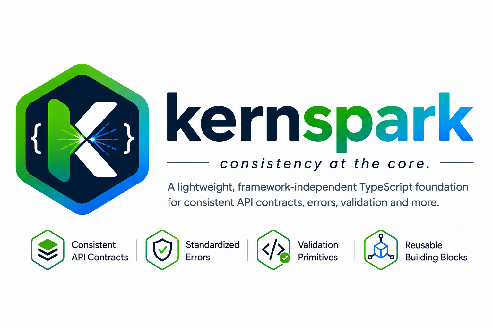

<p align="center">
  
</p>

# KernSpark Ecosystem

[](https://opensource.org/licenses/Apache-2.0)
[](https://www.typescriptlang.org/)
[](https://nodejs.org/)

A lightweight, framework-independent TypeScript foundation for consistent API contracts, standardized application errors, validation primitives, and reusable backend building blocks. Works **with** the TypeScript ecosystem rather than trying to replace it.

## Table of Contents

- [What is it?](#what-is-it)
- [Why does it exist?](#why-does-it-exist)
- [Architecture](#architecture)
- [Packages](#packages)
- [When to use it](#when-to-use-it)
- [When NOT to use it](#when-not-to-use-it)
- [Installation](#installation)
  - [Core only](#core-only)
  - [Express](#express)
  - [NestJS](#nestjs)
  - [Fastify](#fastify)
  - [Hono](#hono)
  - [Next.js](#nextjs)
  - [Nuxt](#nuxt)
  - [SvelteKit](#sveltekit)
  - [Remix](#remix)
  - [ElysiaJS](#elysiajs)
  - [Koa](#koa)
  - [Nitro](#nitro)
  - [AdonisJS](#adonisjs)
  - [Feathers](#feathers)
  - [SailsJS](#sailsjs)
  - [Strapi](#strapi)
  - [tRPC](#trpc)
- [Core Concepts](#core-concepts)
  - [API Response Envelope](#api-response-envelope)
  - [Application Errors](#application-errors)
  - [Result Type](#result-type)
  - [Pagination](#pagination)
  - [Domain Primitives](#domain-primitives)
  - [Validation](#validation)
  - [Utilities](#utilities)
- [Framework Integration](#framework-integration)
  - [Express Integration](#express-integration)
  - [NestJS Integration](#nestjs-integration)
  - [Fastify Integration](#fastify-integration)
  - [Hono Integration](#hono-integration)
  - [Next.js Integration](#nextjs-integration)
  - [Nuxt Integration](#nuxt-integration)
  - [SvelteKit Integration](#sveltekit-integration)
  - [Remix Integration](#remix-integration)
  - [ElysiaJS Integration](#elysiajs-integration)
  - [Koa Integration](#koa-integration)
  - [Nitro Integration](#nitro-integration)
  - [AdonisJS Integration](#adonisjs-integration)
  - [Feathers Integration](#feathers-integration)
  - [SailsJS Integration](#sailsjs-integration)
  - [Strapi Integration](#strapi-integration)
  - [tRPC Integration](#trpc-integration)
- [Frontend / Mobile Consumption](#frontend--mobile-consumption)
- [Correlation / Request IDs](#correlation--request-ids)
- [TypeScript Support](#typescript-support)
- [Compatibility Matrix](#compatibility-matrix)
- [Security](#security)
- [Testing](#testing)
- [Versioning](#versioning)
- [Contributing](#contributing)
- [License](#license)
- [Author](#author)

## What is it?

The KernSpark is a collection of open-source TypeScript packages that provide a **common foundation** for building consistent, production-ready backend APIs. It is inspired by Domain-Driven Design (DDD) principles and the concept of a **KernSpark** — a lightweight set of contracts, types, and behaviors that multiple teams or services can depend on without creating tight coupling.

The ecosystem is organized around:

1. **One framework-independent core package** — `@syncafricabs/kernspark-core`
2. **Optional framework-specific adapters** — Express, NestJS, Fastify, Hono

This means you can use the core in any TypeScript/JavaScript project, and only add the framework adapter when you need framework-specific integration.

## Why does it exist?

Modern backend systems often suffer from inconsistent API responses, duplicated error handling logic, and scattered validation rules. Every team ends up reinventing:

- Standardized JSON envelopes
- Exception hierarchies
- Input validation helpers
- Response builders
- Error-to-HTTP mapping

This project solves that by providing a **single, well-tested, open-source foundation** that works across frameworks and languages. The goal is that an independent development team can confidently install these packages in production because they are:

- Technically sound
- Well documented
- Secure
- Stable
- Genuinely useful

## Architecture

```
@syncafricabs/kernspark-core
    |
    +-- Framework-independent functionality
    |
    +-- API response models
    +-- API response factory
    +-- Application/domain exceptions
    +-- Validation primitives
    +-- Result<T, E>
    +-- Pagination
    +-- Common types
    +-- Generic utilities
    +-- Domain primitives

Framework adapters:

@syncafricabs/kernspark-express
    |
    +-- Express-specific middleware
    +-- Express exception handler
    +-- Express response adapter

@syncafricabs/kernspark-nestjs
    |
    +-- NestJS-specific filters
    +-- NestJS integration
    +-- NestJS response/error adapters

@syncafricabs/kernspark-fastify
    |
    +-- Fastify-specific error handling
    +-- Fastify integration
    +-- Fastify response adapter

@syncafricabs/kernspark-hono
    |
    +-- Hono-specific middleware
    +-- Hono integration
    +-- Hono response adapter

@syncafricabs/kernspark-nextjs
    |
    +-- Next.js API route handlers
    +-- Next.js error handling
    +-- App Router and Pages Router adapters

@syncafricabs/kernspark-nuxt
    |
    +-- Nuxt server route handlers
    +-- Nuxt error handling
    +-- Nuxt integration

@syncafricabs/kernspark-sveltekit
    |
    +-- SvelteKit handle integration
    +-- SvelteKit error handling
    +-- SvelteKit response adapters

@syncafricabs/kernspark-remix
    |
    +-- Remix loader/action wrappers
    +-- Remix error handling
    +-- Remix integration

@syncafricabs/kernspark-elysiajs
    |
    +-- ElysiaJS plugin
    +-- ElysiaJS error handling
    +-- ElysiaJS response adapters

@syncafricabs/kernspark-koa
    |
    +-- Koa middleware
    +-- Koa error handling
    +-- Koa response adapters

@syncafricabs/kernspark-nitro
    |
    +-- Nitro route handlers
    +-- Nitro error handling
    +-- Nitro integration

@syncafricabs/kernspark-adonisjs
    |
    +-- AdonisJS exception handlers
    +-- AdonisJS response macros
    +-- AdonisJS integration

@syncafricabs/kernspark-feathers
    |
    +-- Feathers service hooks
    +-- Feathers error handling
    +-- Feathers integration

@syncafricabs/kernspark-sailsjs
    |
    +-- SailsJS response interceptors
    +-- SailsJS error handling
    +-- SailsJS integration

@syncafricabs/kernspark-strapi
    |
    +-- Strapi lifecycle middleware
    +-- Strapi error handling
    +-- Strapi integration

@syncafricabs/kernspark-trpc
    |
    +-- tRPC error formatter
    +-- tRPC middleware
    +-- tRPC response adapters
```

**Key architectural rule:** The core package must **NOT** depend on Express, NestJS, Fastify, Hono, or any specific web framework. Framework-specific functionality belongs in adapter packages.

```
Express -> kernspark-express -> kernspark-core
NestJS  -> kernspark-nestjs  -> kernspark-core
Fastify -> kernspark-fastify -> kernspark-core
Hono    -> kernspark-hono    -> kernspark-core
Next.js -> kernspark-nextjs  -> kernspark-core
Nuxt    -> kernspark-nuxt    -> kernspark-core
SvelteKit -> kernspark-sveltekit -> kernspark-core
Remix   -> kernspark-remix   -> kernspark-core
ElysiaJS -> kernspark-elysiajs -> kernspark-core
Koa     -> kernspark-koa     -> kernspark-core
Nitro   -> kernspark-nitro   -> kernspark-core
AdonisJS -> kernspark-adonisjs -> kernspark-core
Feathers -> kernspark-feathers -> kernspark-core
SailsJS -> kernspark-sailsjs -> kernspark-core
Strapi  -> kernspark-strapi  -> kernspark-core
tRPC    -> kernspark-trpc    -> kernspark-core
```

## Packages

| Package | Description | Install |
|---------|-------------|---------|
| [`@syncafricabs/kernspark-core`](./packages/kernspark-core) | Framework-independent core | `npm install @syncafricabs/kernspark-core` |
| [`@syncafricabs/kernspark-express`](./packages/kernspark-express) | Express adapter | `npm install @syncafricabs/kernspark-express` |
| [`@syncafricabs/kernspark-nestjs`](./packages/kernspark-nestjs) | NestJS adapter | `npm install @syncafricabs/kernspark-nestjs` |
| [`@syncafricabs/kernspark-fastify`](./packages/kernspark-fastify) | Fastify adapter | `npm install @syncafricabs/kernspark-fastify` |
| [`@syncafricabs/kernspark-hono`](./packages/kernspark-hono) | Hono adapter | `npm install @syncafricabs/kernspark-hono` |
| [`@syncafricabs/kernspark-nextjs`](./packages/kernspark-nextjs) | Next.js adapter | `npm install @syncafricabs/kernspark-nextjs` |
| [`@syncafricabs/kernspark-nuxt`](./packages/kernspark-nuxt) | Nuxt adapter | `npm install @syncafricabs/kernspark-nuxt` |
| [`@syncafricabs/kernspark-sveltekit`](./packages/kernspark-sveltekit) | SvelteKit adapter | `npm install @syncafricabs/kernspark-sveltekit` |
| [`@syncafricabs/kernspark-remix`](./packages/kernspark-remix) | Remix adapter | `npm install @syncafricabs/kernspark-remix` |
| [`@syncafricabs/kernspark-elysiajs`](./packages/kernspark-elysiajs) | ElysiaJS adapter | `npm install @syncafricabs/kernspark-elysiajs` |
| [`@syncafricabs/kernspark-koa`](./packages/kernspark-koa) | Koa adapter | `npm install @syncafricabs/kernspark-koa` |
| [`@syncafricabs/kernspark-nitro`](./packages/kernspark-nitro) | Nitro adapter | `npm install @syncafricabs/kernspark-nitro` |
| [`@syncafricabs/kernspark-adonisjs`](./packages/kernspark-adonisjs) | AdonisJS adapter | `npm install @syncafricabs/kernspark-adonisjs` |
| [`@syncafricabs/kernspark-feathers`](./packages/kernspark-feathers) | Feathers adapter | `npm install @syncafricabs/kernspark-feathers` |
| [`@syncafricabs/kernspark-sailsjs`](./packages/kernspark-sailsjs) | SailsJS adapter | `npm install @syncafricabs/kernspark-sailsjs` |
| [`@syncafricabs/kernspark-strapi`](./packages/kernspark-strapi) | Strapi adapter | `npm install @syncafricabs/kernspark-strapi` |
| [`@syncafricabs/kernspark-trpc`](./packages/kernspark-trpc) | tRPC adapter | `npm install @syncafricabs/kernspark-trpc` |

## When to use it

- You want **consistent API responses** across multiple services or frameworks
- You need a **shared exception hierarchy** that works across bounded contexts
- You want to reduce boilerplate for validation, pagination, and response formatting
- You are building a **microservice architecture** where multiple teams share common contracts
- You want **framework flexibility** — core logic that can run on Express, NestJS, Fastify, Hono, Next.js, Nuxt, SvelteKit, Remix, ElysiaJS, Koa, Nitro, AdonisJS, Feathers, SailsJS, Strapi, tRPC, or any other supported framework
- You need **production-ready** building blocks that are open-source and community-driven

## When NOT to use it

- You need a full backend framework (this is not Express, NestJS, Fastify, Hono, Next.js, Nuxt, SvelteKit, Remix, ElysiaJS, Koa, Nitro, AdonisJS, Feathers, SailsJS, Strapi, or tRPC)
- You need an ORM or database access layer (use Prisma, TypeORM, etc.)
- You need authentication/authorization frameworks (use Passport, Casbin, etc.)
- You need logging frameworks (use Pino, Winston, etc.)
- You need validation frameworks (use Zod, Joi, class-validator — this complements them)
- You need application-specific business logic (keep that in your domain layer)

**Philosophy:** Complement the existing ecosystem, don't replace it.

## Installation

### Core only

If you only want framework-independent functionality:

```bash
npm install @syncafricabs/kernspark-core
```

```typescript
import {
  DataEnvelopeFactory,
  NotFoundError,
  ValidationError,
  Result,
  FieldValidator,
  UUID,
  Money,
  PageRequest,
} from '@syncafricabs/kernspark-core';
```

### Express

```bash
npm install @syncafricabs/kernspark-core @syncafricabs/kernspark-express express
```

### NestJS

```bash
npm install @syncafricabs/kernspark-core @syncafricabs/kernspark-nestjs @nestjs/common @nestjs/core @nestjs/platform-express reflect-metadata rxjs
```

### Fastify

```bash
npm install @syncafricabs/kernspark-core @syncafricabs/kernspark-fastify fastify
```

### Hono

```bash
npm install @syncafricabs/kernspark-core @syncafricabs/kernspark-hono hono
```

### Next.js

```bash
npm install @syncafricabs/kernspark-core @syncafricabs/kernspark-nextjs next
```

### Nuxt

```bash
npm install @syncafricabs/kernspark-core @syncafricabs/kernspark-nuxt nuxt
```

### SvelteKit

```bash
npm install @syncafricabs/kernspark-core @syncafricabs/kernspark-sveltekit @sveltejs/kit
```

### Remix

```bash
npm install @syncafricabs/kernspark-core @syncafricabs/kernspark-remix @remix-run/node
```

### ElysiaJS

```bash
npm install @syncafricabs/kernspark-core @syncafricabs/kernspark-elysiajs elysia
```

### Koa

```bash
npm install @syncafricabs/kernspark-core @syncafricabs/kernspark-koa koa
```

### Nitro

```bash
npm install @syncafricabs/kernspark-core @syncafricabs/kernspark-nitro nitro
```

### AdonisJS

```bash
npm install @syncafricabs/kernspark-core @syncafricabs/kernspark-adonisjs @adonisjs/core
```

### Feathers

```bash
npm install @syncafricabs/kernspark-core @syncafricabs/kernspark-feathers @feathersjs/feathers
```

### SailsJS

```bash
npm install @syncafricabs/kernspark-core @syncafricabs/kernspark-sailsjs sails
```

### Strapi

```bash
npm install @syncafricabs/kernspark-core @syncafricabs/kernspark-strapi @strapi/strapi
```

### tRPC

```bash
npm install @syncafricabs/kernspark-core @syncafricabs/kernspark-trpc @trpc/server
```

## Core Concepts

### API Response Envelope

All API responses follow a standardized envelope structure:

```json
// Success
{
  "status": 200,
  "success": true,
  "data": { "id": 1, "name": "John" },
  "message": "OK"
}

// Error
{
  "status": 400,
  "success": false,
  "errorCode": "USER_EMAIL_REQUIRED",
  "message": "Email is required",
  "data": null
}
```

**Key design decisions:**

- `status` is the HTTP status code (for HTTP adapters) or application status code
- `success` is a boolean discriminator for type-safe handling
- `errorCode` is a **machine-readable** application error code, separate from HTTP status
- `data` carries the payload for success responses or error details for error responses
- `message` is the human-readable description

**Why separate `errorCode` from HTTP status?**

Multiple business errors can share the same HTTP status (e.g., many validation errors return 400) while still being distinguishable by frontend/mobile clients:

```json
{
  "status": 400,
  "success": false,
  "errorCode": "USER_EMAIL_REQUIRED",
  "message": "Email is required"
}
```

vs

```json
{
  "status": 400,
  "success": false,
  "errorCode": "USER_PASSWORD_TOO_SHORT",
  "message": "Password must be at least 8 characters"
}
```

### Application Errors

The core provides a refined exception hierarchy:

```
ApplicationError (base)
├── ValidationError
│   ├── MissingFieldsError
│   └── InvalidError
├── BusinessError
│   ├── ConflictError
│   ├── AlreadyExistsError
│   ├── InsufficientFundsError
│   ├── QuotaExceededError
│   ├── NotFoundError
│   ├── DoesNotExistError
│   ├── ExpiredError
│   ├── TooManyRequestsError
│   ├── PaymentRequiredError
│   ├── LockedError
│   ├── AccountSuspendedError
│   ├── FeatureNotAvailableError
│   └── DataIntegrityError
├── AuthenticationError
│   ├── InvalidTokenError
│   ├── TokenExpiredError
│   └── SessionExpiredError
├── AuthorizationError
│   ├── PermissionDeniedError
│   └── NotAllowedError
└── InfrastructureError
    ├── ExternalServiceError
    ├── BadGatewayError
    ├── GatewayTimeoutError
    ├── ServiceUnavailableError
    ├── RequestFailedError
    └── NotImplementedError
```

Each error carries:
- `errorCode` — machine-readable code (e.g., `USER_NOT_FOUND`)
- `statusCode` — HTTP status for adapters
- `message` — human-readable description
- `cause` — optional underlying error

**Usage:**

```typescript
import { NotFoundError, ValidationError, ConflictError } from '@syncafricabs/kernspark-core';

// Throw in your service layer
throw new NotFoundError('User not found');
throw new ValidationError('INVALID_EMAIL', 'Email format is invalid');
throw new ConflictError('User already exists');
```

Framework adapters automatically map these to HTTP responses.

### Result Type

The `Result<T, E>` type allows developers to choose between exceptions and explicit success/failure results:

```typescript
import { Result, Ok, Err } from '@syncafricabs/kernspark-core';

function findUser(id: string): Result<User, NotFoundError> {
  const user = database.find(id);
  if (!user) {
    return Err(new NotFoundError('User not found'));
  }
  return Ok(user);
}

// Usage
const result = findUser('123');
if (result.isOk()) {
  console.log(result.unwrap().name);
} else {
  console.error(result.unwrapErr().message);
}

// Or use match for functional handling
const message = result.match(
  (user) => `Found ${user.name}`,
  (error) => `Error: ${error.message}`
);
```

This makes the core useful **outside HTTP applications** — in CLI tools, background jobs, domain logic, etc.

### Pagination

Standardized pagination types:

```typescript
import { PageRequest, PageResponse } from '@syncafricabs/kernspark-core';

const request: PageRequest = {
  page: 1,
  pageSize: 20,
  sort: 'createdAt',
  sortOrder: 'desc',
};

const response: PageResponse<User> = {
  data: users,
  page: 1,
  pageSize: 20,
  totalItems: 100,
  totalPages: 5,
  hasNext: true,
  hasPrevious: false,
};
```

### Domain Primitives

Carefully designed framework-independent primitives:

```typescript
import { UUID, Money, DateRange, Entity, ValueObject, DomainEvent } from '@syncafricabs/kernspark-core';

// UUID with validation
const id = UUID.generate();
const anotherId = new UUID('550e8400-e29b-41d4-a716-446655440000');

// Money with currency safety
const price = new Money(1000, 'USD');
const tax = new Money(160, 'USD');
const total = price.add(tax); // Money { amount: 1160, currency: 'USD' }

// DateRange
const range = DateRange.create(
  new Date('2024-01-01'),
  new Date('2024-12-31')
);

// Entity base class
interface UserEntity extends Entity<string> {
  name: string;
  email: string;
}

// ValueObject base class
class Email implements ValueObject<string> {
  constructor(public readonly value: string) {}
  equals(other: Email): boolean {
    return this.value === other.value;
  }
}

// DomainEvent
interface UserCreatedEvent extends DomainEvent {
  readonly userId: string;
  readonly email: string;
}
```

### Validation

`FieldValidator` provides generic validation primitives that complement (not replace) Zod, Joi, or class-validator:

```typescript
import { FieldValidator } from '@syncafricabs/kernspark-core';

FieldValidator.validateString(name, 'Name', 2, 100);
FieldValidator.validateEmail(email, 'Email');
FieldValidator.validatePhone(phone, 'Phone');
FieldValidator.validateUrl(website, 'Website');
FieldValidator.validateUUID(id, 'Id');
FieldValidator.validatePositiveLong(userId, 'UserId');
FieldValidator.validateNonNull(value, 'Value');
FieldValidator.validateNonEmptyList(items, 'Items');
FieldValidator.validateEnum(Gender, gender, 'Gender');
FieldValidator.validateInteger(count, 'Count');
FieldValidator.validatePeriod(days, 'Days');
FieldValidator.validateSizeLimit(limit, 'Limit');
FieldValidator.validateFee(fee, 'Fee');
FieldValidator.validateBoolean(active, 'Active');
FieldValidator.validatePattern(code, /^[A-Z]{3}$/, 'Code');
FieldValidator.validateNumericRange(age, 18, 120, 'Age');
FieldValidator.validateColumnName(columnName, 'ColumnName');
FieldValidator.validateDateOfBirth(dob, 'DateOfBirth');
FieldValidator.validatePaymentDate(paymentDate, 'PaymentDate');
FieldValidator.validateOpeningDate(openingDate, 'OpeningDate');
```

**Important:** Business rules should remain in your application's domain/application layer. This package provides generic primitives, not a complete validation framework.

### Utilities

Slim, generic utilities only:

```typescript
import { BaseUtils } from '@syncafricabs/kernspark-core';

BaseUtils.isNullOrEmpty(value);
BaseUtils.generateSlug('Hello World'); // "hello-world"
BaseUtils.truncate('Some long text...', 10); // "Some long ..."
BaseUtils.maskString('1234567890'); // "******7890"
BaseUtils.formatCurrency(99.99, 'USD'); // "$99.99"
BaseUtils.formatPercentage(0.1567); // "15.67%"
BaseUtils.sleep(1000); // Promise<void>
BaseUtils.randomString(16); // random alphanumeric string
```

**Note:** HTML sanitization has been removed from the core. Use a dedicated, well-maintained sanitization library for security-sensitive operations.

## Framework Integration

### Express Integration

See [`@syncafricabs/kernspark-express`](./packages/kernspark-express/README.md) for full documentation.

Quick example:

```typescript
import express from 'express';
import { expressErrorHandler, correlationIdMiddleware, ExpressResponseAdapter } from '@syncafricabs/kernspark-express';
import { NotFoundError, ValidationError } from '@syncafricabs/kernspark-core';

const app = express();

app.use(express.json());
app.use(correlationIdMiddleware());
app.use(expressErrorHandler());

app.get('/users/:id', (req, res) => {
  const user = findUser(req.params.id);
  if (!user) {
    throw new NotFoundError('User not found');
  }
  return ExpressResponseAdapter.ok(res, user, 'User retrieved');
});

app.listen(3000);
```

**Features:**
- Drop-in Express error middleware
- Correlation ID propagation
- Request/response logging with sanitization
- Full TypeScript support

### NestJS Integration

See [`@syncafricabs/kernspark-nestjs`](./packages/kernspark-nestjs/README.md) for full documentation.

Quick example:

```typescript
import { Module } from '@nestjs/common';
import { APP_FILTER, APP_INTERCEPTOR } from '@nestjs/core';
import { NestJsExceptionFilter, NestJsResponseInterceptor } from '@syncafricabs/kernspark-nestjs';
import { NotFoundError, ValidationError } from '@syncafricabs/kernspark-core';

@Module({
  providers: [
    { provide: APP_FILTER, useClass: NestJsExceptionFilter },
    { provide: APP_INTERCEPTOR, useClass: NestJsResponseInterceptor },
  ],
})
export class AppModule {}
```

```typescript
import { Controller, Get, Param } from '@nestjs/common';
import { NotFoundError } from '@syncafricabs/kernspark-core';

@Controller('users')
export class UsersController {
  @Get(':id')
  findOne(@Param('id') id: string) {
    const user = findUser(id);
    if (!user) {
      throw new NotFoundError('User not found');
    }
    return user;
  }
}
```

**Features:**
- Global exception filter
- Response interceptor
- Dynamic module with `forRoot()` and `forRootAsync()`
- Decorator metadata support

### Fastify Integration

See [`@syncafricabs/kernspark-fastify`](./packages/kernspark-fastify/README.md) for full documentation.

Quick example:

```typescript
import Fastify from 'fastify';
import { fastifyPlugin, fastifyErrorHandler, FastifyResponseAdapter } from '@syncafricabs/kernspark-fastify';
import { NotFoundError } from '@syncafricabs/kernspark-core';

const app = Fastify({ logger: true });

await app.register(fastifyPlugin);

app.get('/users/:id', async (request, reply) => {
  const user = findUser(request.params.id);
  if (!user) {
    throw new NotFoundError('User not found');
  }
  return FastifyResponseAdapter.ok(reply, user);
});

app.setErrorHandler(fastifyErrorHandler());

await app.listen({ port: 3000 });
```

**Features:**
- Fastify plugin with hooks
- Error handler
- Correlation ID propagation
- Request/response logging

### Hono Integration

See [`@syncafricabs/kernspark-hono`](./packages/kernspark-hono/README.md) for full documentation.

Quick example:

```typescript
import { Hono } from 'hono';
import { honoErrorHandler, correlationIdMiddleware, HonoResponseAdapter } from '@syncafricabs/kernspark-hono';
import { NotFoundError } from '@syncafricabs/kernspark-core';

const app = new Hono();

app.use('*', correlationIdMiddleware());

app.get('/users/:id', (c) => {
  const user = findUser(c.req.param('id'));
  if (!user) {
    throw new NotFoundError('User not found');
  }
  return HonoResponseAdapter.ok(c, user);
});

app.onError(honoErrorHandler());

export default app;
```

**Features:**
- Hono middleware
- Error handler
- Edge-ready (Cloudflare Workers, Deno, Bun, Node.js)
- Correlation ID propagation

### Next.js Integration

See [`@syncafricabs/kernspark-nextjs`](./packages/kernspark-nextjs/README.md) for full documentation.

Quick example:

```typescript
import { NextResponse } from 'next/server';
import { nextJsApiHandler, NextJsResponseAdapter } from '@syncafricabs/kernspark-nextjs';
import { NotFoundError } from '@syncafricabs/kernspark-core';

export const GET = nextJsApiHandler(async (req) => {
  const user = findUser(req.params.id);
  if (!user) {
    throw new NotFoundError('User not found');
  }
  return NextJsResponseAdapter.ok(user, 'User retrieved');
});
```

**Features:**
- App Router and Pages Router support
- API route handler wrapper
- Error handling for both routers
- Full TypeScript support

### Nuxt Integration

See [`@syncafricabs/kernspark-nuxt`](./packages/kernspark-nuxt/README.md) for full documentation.

Quick example:

```typescript
import { defineEventHandler, readBody } from 'h3';
import { nuxtErrorHandler, NuxtResponseAdapter } from '@syncafricabs/kernspark-nuxt';
import { ValidationError } from '@syncafricabs/kernspark-core';

export default defineEventHandler(async (event) => {
  const body = await readBody(event);
  if (!body.email) {
    throw new ValidationError('EMAIL_REQUIRED', 'Email is required');
  }
  return NuxtResponseAdapter.ok(event, { message: 'OK' });
});
```

**Features:**
- Server route integration
- Error handling middleware
- Response adapter helpers

### SvelteKit Integration

See [`@syncafricabs/kernspark-sveltekit`](./packages/kernspark-sveltekit/README.md) for full documentation.

Quick example:

```typescript
import { fail, redirect } from '@sveltejs/kit';
import { svelteKitHandle, SvelteKitResponseAdapter } from '@syncafricabs/kernspark-sveltekit';
import { NotFoundError } from '@syncafricabs/kernspark-core';

export const load = async (params) => {
  const user = findUser(params.id);
  if (!user) {
    throw new NotFoundError('User not found');
  }
  return SvelteKitResponseAdapter.ok(user);
};
```

**Features:**
- SvelteKit handle() integration
- Error handling for load/actions
- Response adapter helpers

### Remix Integration

See [`@syncafricabs/kernspark-remix`](./packages/kernspark-remix/README.md) for full documentation.

Quick example:

```typescript
import { json } from '@remix-run/node';
import { remixLoader, RemixResponseAdapter } from '@syncafricabs/kernspark-remix';
import { NotFoundError } from '@syncafricabs/kernspark-core';

export const loader = remixLoader(async ({ params }) => {
  const user = findUser(params.id);
  if (!user) {
    throw new NotFoundError('User not found');
  }
  return RemixResponseAdapter.ok(user);
});
```

**Features:**
- Loader and action wrappers
- Error handling for Remix
- Response adapter helpers

### ElysiaJS Integration

See [`@syncafricabs/kernspark-elysiajs`](./packages/kernspark-elysiajs/README.md) for full documentation.

Quick example:

```typescript
import { Elysia } from 'elysia';
import { elysiaPlugin, elysiaErrorHandler, ElysiaJsResponseAdapter } from '@syncafricabs/kernspark-elysiajs';
import { NotFoundError } from '@syncafricabs/kernspark-core';

const app = new Elysia()
  .use(elysiaPlugin())
  .get('/users/:id', async ({ params }) => {
    const user = findUser(params.id);
    if (!user) {
      throw new NotFoundError('User not found');
    }
    return ElysiaJsResponseAdapter.ok(user);
  })
  .setErrorHandler(elysiaErrorHandler());
```

**Features:**
- ElysiaJS plugin
- Error handler
- Response adapter helpers

### Koa Integration

See [`@syncafricabs/kernspark-koa`](./packages/kernspark-koa/README.md) for full documentation.

Quick example:

```typescript
import Koa from 'koa';
import { koaErrorHandler, KoaResponseAdapter } from '@syncafricabs/kernspark-koa';
import { NotFoundError } from '@syncafricabs/kernspark-core';

const app = new Koa();

app.use(koaErrorHandler());

app.get('/users/:id', async (ctx) => {
  const user = findUser(ctx.params.id);
  if (!user) {
    throw new NotFoundError('User not found');
  }
  return KoaResponseAdapter.ok(ctx, user);
});
```

**Features:**
- Koa middleware
- Error handler
- Response adapter helpers

### Nitro Integration

See [`@syncafricabs/kernspark-nitro`](./packages/kernspark-nitro/README.md) for full documentation.

Quick example:

```typescript
import { defineEventHandler, readBody } from 'nitropack';
import { nitroErrorHandler, NitroResponseAdapter } from '@syncafricabs/kernspark-nitro';
import { ValidationError } from '@syncafricabs/kernspark-core';

export default defineEventHandler(async (event) => {
  const body = await readBody(event);
  if (!body.email) {
    throw new ValidationError('EMAIL_REQUIRED', 'Email is required');
  }
  return NitroResponseAdapter.ok(event, { message: 'OK' });
});
```

**Features:**
- Nitro route handler integration
- Error handling
- Response adapter helpers

### AdonisJS Integration

See [`@syncafricabs/kernspark-adonisjs`](./packages/kernspark-adonisjs/README.md) for full documentation.

Quick example:

```typescript
import { HttpContext } from '@adonisjs/core';
import { adonisExceptionHandler, AdonisJsResponseAdapter } from '@syncafricabs/kernspark-adonisjs';
import { NotFoundError } from '@syncafricabs/kernspark-core';

export default class UsersController {
  async show({ params }: HttpContext) {
    const user = findUser(params.id);
    if (!user) {
      throw new NotFoundError('User not found');
    }
    return AdonisJsResponseAdapter.ok(user);
  }
}
```

**Features:**
- AdonisJS exception handler
- Response macros
- Type-safe integration

### Feathers Integration

See [`@syncafricabs/kernspark-feathers`](./packages/kernspark-feathers/README.md) for full documentation.

Quick example:

```typescript
import { feathersErrorHandler, FeathersResponseAdapter } from '@syncafricabs/kernspark-feathers';
import { NotFoundError } from '@syncafricabs/kernspark-core';

export class UserService {
  async get(id: string) {
    const user = findUser(id);
    if (!user) {
      throw new NotFoundError('User not found');
    }
    return FeathersResponseAdapter.ok(user);
  }
}
```

**Features:**
- Feathers service hooks
- Error handling
- Response adapter helpers

### SailsJS Integration

See [`@syncafricabs/kernspark-sailsjs`](./packages/kernspark-sailsjs/README.md) for full documentation.

Quick example:

```typescript
import { sailsResponseInterceptor, SailsJsResponseAdapter } from '@syncafricabs/kernspark-sailsjs';
import { NotFoundError } from '@syncafricabs/kernspark-core';

module.exports = {
  findOne: async (req, res) => {
    const user = findUser(req.params.id);
    if (!user) {
      throw new NotFoundError('User not found');
    }
    return SailsJsResponseAdapter.ok(res, user);
  }
};
```

**Features:**
- SailsJS response interceptor
- Error handling
- Response adapter helpers

### Strapi Integration

See [`@syncafricabs/kernspark-strapi`](./packages/kernspark-strapi/README.md) for full documentation.

Quick example:

```typescript
import { strapiErrorHandler, StrapiResponseAdapter } from '@syncafricabs/kernspark-strapi';
import { NotFoundError } from '@syncafricabs/kernspark-core';

module.exports = {
  lifecycles: {
    beforeCreate: async (data) => {
      if (!data.email) {
        throw new NotFoundError('Email is required');
      }
    }
  }
};
```

**Features:**
- Strapi lifecycle middleware
- Error handling
- Response adapter helpers

### tRPC Integration

See [`@syncafricabs/kernspark-trpc`](./packages/kernspark-trpc/README.md) for full documentation.

Quick example:

```typescript
import { initTRPC } from '@trpc/server';
import { trpcErrorFormatter } from '@syncafricabs/kernspark-trpc';
import { NotFoundError } from '@syncafricabs/kernspark-core';

const t = initTRPC.context<Context>().create({
  errorFormatter: trpcErrorFormatter,
});

export const appRouter = t.router({
  getUser: t.procedure.query(async () => {
    const user = findUser('123');
    if (!user) {
      throw new NotFoundError('User not found');
    }
    return user;
  }),
});
```

**Features:**
- tRPC error formatter
- Middleware support
- Type-safe integration

## Frontend / Mobile Consumption

The standardized responses are designed to be consumed by React, Angular, Vue, Flutter, mobile, and other clients. The core package provides shared types, validation primitives, and error codes that keep frontend and backend in sync.

### Why use the core in frontend apps?

- **Shared types** — `Delivered`, `Failed`, `PageRequest`, `PageResponse` keep frontend and backend aligned
- **Shared validation** — `FieldValidator` lets you reuse validation rules without duplicating them
- **Shared error codes** — Handle `errorCode` values the same way the backend does
- **Domain primitives** — `Money`, `UUID`, `DateRange` behave consistently on client and server
- **Result type** — `Result<T, E>` works in UI state machines, form flows, and data fetching

### Shared response types

Install the core in your frontend app:

```bash
npm install @syncafricabs/kernspark-core
```

Then import the types and helpers:

```typescript
import type { Delivered, Failed, DataEnvelope } from '@syncafricabs/kernspark-core';

type DataEnvelope<T> = 
  | { success: true; data: T; message: string; status: number }
  | { success: false; errorCode: string; message: string; data: any; status: number };
```

### React usage

```tsx
import { useState, useEffect } from 'react';
import type { DataEnvelope, Delivered, Failed } from '@syncafricabs/kernspark-core';
import { FieldValidator } from '@syncafricabs/kernspark-core';

type User = {
  id: string;
  name: string;
  email: string;
};

export function UserProfile({ userId }: { userId: string }) {
  const [user, setUser] = useState<User | null>(null);
  const [error, setError] = useState<string | null>(null);
  const [loading, setLoading] = useState(true);

  useEffect(() => {
    fetch(`/api/users/${userId}`)
      .then((res) => res.json() as Promise<DataEnvelope<User>>)
      .then((result) => {
        if (!result.success) {
          switch (result.errorCode) {
            case 'NOT_FOUND':
              setError('User not found');
              break;
            case 'UNAUTHORIZED':
              window.location.href = '/login';
              break;
            default:
              setError(result.message);
          }
          return;
        }
        setUser(result.data);
      })
      .finally(() => setLoading(false));
  }, [userId]);

  if (loading) return <p>Loading...</p>;
  if (error) return <p style={{ color: 'red' }}>{error}</p>;
  if (!user) return null;

  return (
    <div>
      <h1>{user.name}</h1>
      <p>{user.email}</p>
    </div>
  );
}

// Form validation example
export function SignupForm() {
  const [email, setEmail] = useState('');
  const [errors, setErrors] = useState<string[]>([]);

  const validate = () => {
    const fieldErrors: string[] = [];

    try {
      FieldValidator.validateEmail(email, 'Email');
    } catch (err) {
      fieldErrors.push(err instanceof Error ? err.message : 'Invalid email');
    }

    setErrors(fieldErrors);
    return fieldErrors.length === 0;
  };

  const handleSubmit = (e: React.FormEvent) => {
    e.preventDefault();
    if (validate()) {
      // submit
    }
  };

  return (
    <form onSubmit={handleSubmit}>
      <input value={email} onChange={(e) => setEmail(e.target.value)} />
      {errors.map((error) => (
        <p key={error} style={{ color: 'red' }}>{error}</p>
      ))}
      <button type="submit">Sign up</button>
    </form>
  );
}
```

### Angular usage

```typescript
import { Injectable } from '@angular/core';
import { HttpClient, HttpErrorResponse } from '@angular/common/http';
import { Observable, throwError } from 'rxjs';
import { catchError, map } from 'rxjs/operators';
import type { DataEnvelope, Delivered, Failed } from '@syncafricabs/kernspark-core';
import { NotFoundError, UnauthorizedError } from '@syncafricabs/kernspark-core';

type User = {
  id: string;
  name: string;
  email: string;
};

@Injectable({ providedIn: 'root' })
export class UserService {
  constructor(private http: HttpClient) {}

  getUser(userId: string): Observable<User> {
    return this.http.get<DataEnvelope<User>>(`/api/users/${userId}`).pipe(
      map((response: DataEnvelope<User>) => {
        if (!response.success) {
          switch (response.errorCode) {
            case 'NOT_FOUND':
              throw new NotFoundError(response.message);
            case 'UNAUTHORIZED':
              throw new UnauthorizedError(response.message);
            default:
              throw new Error(response.message);
          }
        }
        return response.data;
      }),
      catchError((error: HttpErrorResponse) => {
        return throwError(() => error);
      })
    );
  }
}
```

### Vue usage

```typescript
<script setup lang="ts">
import { ref, onMounted } from 'vue';
import type { DataEnvelope, Delivered, Failed } from '@syncafricabs/kernspark-core';
import { FieldValidator } from '@syncafricabs/kernspark-core';

type User = {
  id: string;
  name: string;
  email: string;
};

const user = ref<User | null>(null);
const error = ref<string | null>(null);
const loading = ref(true);

onMounted(async () => {
  const response = await fetch('/api/users/123');
  const result: DataEnvelope<User> = await response.json();

  if (!result.success) {
    error.value = result.message;
    loading.value = false;
    return;
  }

  user.value = result.data;
  loading.value = false;
});

const email = ref('');
const formErrors = ref<string[]>([]);

const validateEmail = () => {
  const errors: string[] = [];
  try {
    FieldValidator.validateEmail(email.value, 'Email');
  } catch (err) {
    errors.push(err instanceof Error ? err.message : 'Invalid email');
  }
  formErrors.value = errors;
};
</script>

<template>
  <div>
    <div v-if="loading">Loading...</div>
    <div v-else-if="error" style="color: red">{{ error }}</div>
    <div v-else-if="user">
      <h1>{{ user.name }}</h1>
      <p>{{ user.email }}</p>
    </div>
  </div>
</template>
```

### Svelte usage

```typescript
<script lang="ts">
  import type { DataEnvelope, Delivered, Failed } from '@syncafricabs/kernspark-core';
  import { FieldValidator } from '@syncafricabs/kernspark-core';

  export let userId: string;

  let user: User | null = null;
  let error: string | null = null;
  let loading = true;

  onMount(async () => {
    const response = await fetch(`/api/users/${userId}`);
    const result: DataEnvelope<User> = await response.json();

    if (!result.success) {
      error = result.message;
      loading = false;
      return;
    }

    user = result.data;
    loading = false;
  });

  let email = '';
  let formErrors: string[] = [];

  function validateEmail() {
    formErrors = [];
    try {
      FieldValidator.validateEmail(email, 'Email');
    } catch (err) {
      formErrors.push(err instanceof Error ? err.message : 'Invalid email');
    }
  }
</script>
```

### Generic TypeScript / Node.js usage

Outside of any specific framework, the core is useful in:

- **CLI tools** — use `Result<T, E>` for explicit success/failure handling
- **Background workers** — use `ApplicationError` for structured job failures
- **Monorepos** — share `Money`, `UUID`, `PageRequest`, `PageResponse` across packages
- **Testing** — use `DataEnvelopeFactory` to build predictable test fixtures

```typescript
import { Result, Ok, Err } from '@syncafricabs/kernspark-core';
import { ValidationError } from '@syncafricabs/kernspark-core';

function parseUser(input: unknown): Result<User, ValidationError> {
  if (!isValidUser(input)) {
    return Err(new ValidationError('INVALID_USER', 'Input is not a valid user'));
  }
  return Ok(input as User);
}
```

### Installation for frontend apps

```bash
npm install @syncafricabs/kernspark-core
```

No framework dependencies required. The core has zero runtime dependencies.

## Correlation / Request IDs

Every framework adapter supports correlation ID propagation:

```typescript
// Express
app.use(correlationIdMiddleware());

// Fastify
await app.register(fastifyPlugin);

// Hono
app.use('*', correlationIdMiddleware());
```

Response format with correlation ID:

```json
{
  "status": 200,
  "success": true,
  "data": { "id": 1 },
  "message": "OK",
  "timestamp": "2024-01-15T10:30:00Z",
  "requestId": "550e8400-e29b-41d4-a716-446655440000"
}
```

This is extremely useful for:
- Support ticket tracing
- Distributed logging
- Debugging production issues
- Correlation across microservices

## TypeScript Support

All packages are written in TypeScript with strict mode enabled:

- `strict: true`
- `noImplicitAny: true`
- `strictNullChecks: true`
- Full declaration files (`.d.ts`) included
- Discriminated unions for type-safe response handling
- Generic types throughout (`DataEnvelope<T, E>`, `Result<T, E>`, `PageResponse<T>`)

## Compatibility Matrix

| Package | Node.js | TypeScript | Core |
|---------|---------|------------|------|
| `@syncafricabs/kernspark-core` | >=18.0.0 | 5.0+ | - |
| `@syncafricabs/kernspark-express` | >=18.0.0 | 5.0+ | ^1.0.0 |
| `@syncafricabs/kernspark-nestjs` | >=18.0.0 | 5.0+ | ^1.0.0 |
| `@syncafricabs/kernspark-fastify` | >=18.0.0 | 5.0+ | ^1.0.0 |
| `@syncafricabs/kernspark-hono` | >=18.0.0 | 5.0+ | ^1.0.0 |
| `@syncafricabs/kernspark-nextjs` | >=18.0.0 | 5.0+ | ^1.0.0 |
| `@syncafricabs/kernspark-nuxt` | >=18.0.0 | 5.0+ | ^1.0.0 |
| `@syncafricabs/kernspark-sveltekit` | >=18.0.0 | 5.0+ | ^1.0.0 |
| `@syncafricabs/kernspark-remix` | >=18.0.0 | 5.0+ | ^1.0.0 |
| `@syncafricabs/kernspark-elysiajs` | >=18.0.0 | 5.0+ | ^1.0.0 |
| `@syncafricabs/kernspark-koa` | >=18.0.0 | 5.0+ | ^1.0.0 |
| `@syncafricabs/kernspark-nitro` | >=18.0.0 | 5.0+ | ^1.0.0 |
| `@syncafricabs/kernspark-adonisjs` | >=18.0.0 | 5.0+ | ^1.0.0 |
| `@syncafricabs/kernspark-feathers` | >=18.0.0 | 5.0+ | ^1.0.0 |
| `@syncafricabs/kernspark-sailsjs` | >=18.0.0 | 5.0+ | ^1.0.0 |
| `@syncafricabs/kernspark-strapi` | >=18.0.0 | 5.0+ | ^1.0.0 |
| `@syncafricabs/kernspark-trpc` | >=18.0.0 | 5.0+ | ^1.0.0 |

## Security

- The core has **zero runtime dependencies** — minimal attack surface
- Framework adapters only depend on their respective frameworks
- No security-sensitive functionality (like HTML sanitization) is implemented in the core — use dedicated libraries
- Sensitive fields in logging are automatically redacted
- Correlation IDs help with security auditing and traceability

## Testing

Before recommending for production, establish strong automated testing:

- Response factory tests
- API response type tests
- Validator tests
- Exception hierarchy tests
- Utility tests
- Framework adapter tests
- Middleware behavior tests
- Error mapping tests

## Versioning

This project follows [Semantic Versioning](https://semver.org/):

- `1.x` — backward-compatible feature releases
- `2.0` — intentional breaking changes

Maintain:
- `CHANGELOG.md` per package
- Migration guides for major versions
- Deprecation notices

## Contributing

1. Fork the repository
2. Create your feature branch: `git checkout -b feature/my-feature`
3. Commit your changes: `git commit -am 'Add my feature'`
4. Push to the branch: `git push origin feature/my-feature`
5. Submit a pull request

### Development Setup

This monorepo uses npm workspaces and outputs ESM-only packages (`"type": "module"`).

```bash
# Clone the repository
git clone https://github.com/iamprovy-dev/kernspark-js.git
cd kernspark/javascript

# Install dependencies for all packages
npm install --no-audit --no-fund --legacy-peer-deps

# Build all packages
npm run build

# Run lint
npm run lint

# Run tests
npm test
```

**Notes:**
- `--legacy-peer-deps` is required due to peer dependency conflicts (e.g. Strapi 4.x with Node v24).
- All packages are ESM-only (`module: "NodeNext"`). If you consume them from a CommonJS project, use dynamic `import()` or a transpiler.
- To rebuild a single package: `cd packages/kernspark-<adapter> && npm run build`

### Code Standards

- Use TypeScript with strict mode
- Follow 2-space indentation and semicolons
- Add JSDoc comments for public APIs
- Ensure all tests pass before submitting PR
- Keep the core framework-independent
- Do not add application-specific logic

## License

Apache License, Version 2.0

## Author

**Providence Chikukwa**
- Email: iamprovy@outlook.com
- GitHub: https://github.com/iamprovy-dev
- LinkedIn: https://www.linkedin.com/in/provychikukwa


